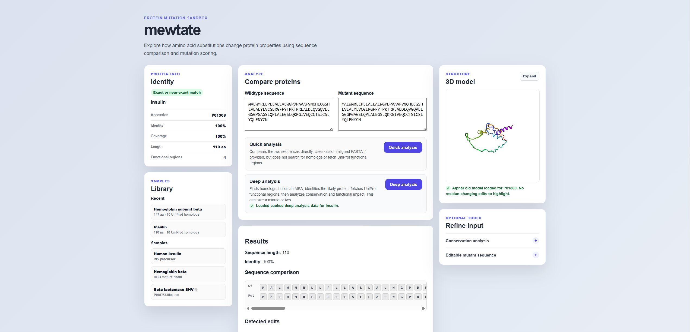

# mewtate

mewtate is an interactive bioinformatics web app for exploring how protein mutations may affect sequence properties, evolutionary conservation, functional regions, and 3D structure context.

The project is built as a  mutation-analysis sandbox: users can enter a wildtype protein sequence, create or paste a mutant sequence, run quick or deep analysis, and inspect the results through sequence views, mutation cards, conservation heatmaps, functional annotations, and an AlphaFold-powered structure viewer.

## Screenshots



## What It Does

- Compares wildtype and mutant protein sequences.
- Detects substitutions, insertions, deletions, and grouped multi-residue indels.
- Scores mutation severity using biochemical properties and BLOSUM62.
- Runs quick analysis for direct sequence comparison.
- Runs deep analysis for protein identification, homolog retrieval, multiple sequence alignment, conservation scoring, and functional-region annotation.
- Identifies likely protein matches through UniProt.
- Retrieves reviewed UniProt homologs when possible to avoid slow NCBI BLAST waits.
- Falls back to NCBI BLAST when UniProt-based homolog discovery is not enough.
- Builds multiple sequence alignments with Clustal Omega through EMBL-EBI.
- Calculates conservation across aligned homologs.
- Displays conservation as both mutation-card details and a sequence heatmap.
- Fetches UniProt functional regions such as active sites, binding sites, domains, motifs, transmembrane regions, signal peptides, modified residues, and disulfide bonds.
- Adjusts mutation severity when mutations affect conserved positions or functional regions.
- Loads AlphaFold structures when available and maps mutations onto the 3D model.
- Caches recent deep-analysis results during the browser session to avoid rerunning expensive homolog and annotation steps.
- Includes sample proteins and a recent-sequence library for faster exploration.

## Analysis Modes

### Quick Analysis

Quick analysis compares the wildtype and mutant sequences directly. It is useful for fast mutation checks and can use a custom aligned FASTA if the user provides one.

Quick analysis does not automatically search for homologs or fetch UniProt functional-region data.

### Deep Analysis

Deep analysis runs the full interpretation workflow:

1. Clean and validate the protein sequence.
2. Identify an exact or near-exact UniProt protein match.
3. Fetch UniProt functional regions.
4. Search for reviewed homologs through UniProt family/name queries.
5. Fall back to NCBI BLAST if needed.
6. Filter homologs by identity, length, duplicates, fragments, and review status.
7. Build an MSA with Clustal Omega.
8. Calculate conservation scores.
9. Compare wildtype and mutant sequences.
10. Adjust severity using biochemical change, conservation, and functional-region context.
11. Load an AlphaFold model when available and highlight affected residues.

## Mutation Interpretation

mewtate combines several sources of evidence:

- **Biochemical severity:** charge, polarity, hydrophobicity, amino acid class, and BLOSUM62 score.
- **Conservation severity:** mutations at highly or moderately conserved positions increase concern.
- **Functional-region severity:** mutations affecting UniProt-annotated functional regions increase concern, especially high-impact regions such as active sites and binding sites.
- **Indel handling:** consecutive insertions and deletions are grouped into clearer mutation events.
- **Structure context:** substitutions and deletions are highlighted directly; insertions highlight the flanking structure residues because the inserted residue does not exist in the wildtype structure.

## Tech Stack

### Backend

- Python
- FastAPI
- Pydantic
- Biopython
- Uvicorn

### Frontend

- Vanilla HTML
- Vanilla CSS
- Vanilla JavaScript
- 3Dmol.js for structure visualization

## How To Run

### 1. Create a virtual environment

Windows PowerShell:

```powershell
python -m venv venv
```

macOS/Linux:

```bash
python3 -m venv venv
```

### 2. Activate the virtual environment

Windows PowerShell:

```powershell
.\venv\Scripts\Activate.ps1
```

macOS/Linux:

```bash
source venv/bin/activate
```

### 3. Install backend dependencies

```bash
pip install -r backend/requirements.txt
```

### 4. Start the FastAPI backend

```bash
python -m uvicorn backend.app:app --reload
```

### 5. Open the frontend

Option A: open directly in a browser:

```text
frontend/index.html
```

## Notes

- Deep analysis uses remote services, so runtime depends on UniProt, NCBI BLAST, EMBL-EBI Clustal Omega, and AlphaFold DB availability.
- The app does not predict a mutant protein structure from scratch. It maps mutations onto the available wildtype/reference structure when possible.
- Recent sequence data is stored temporarily in browser session storage.

